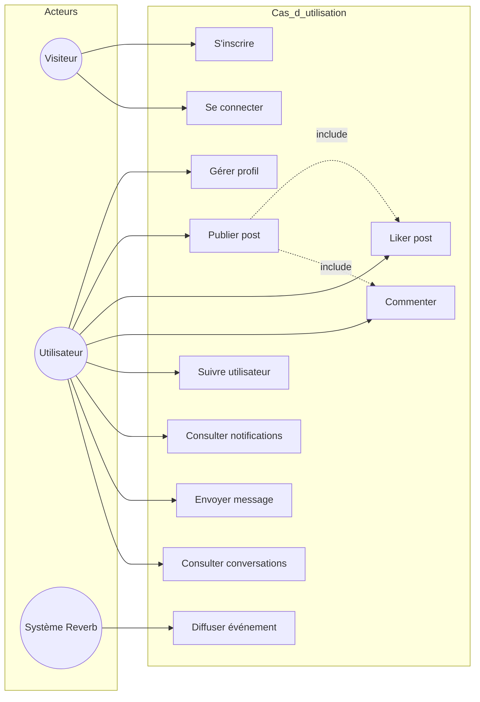
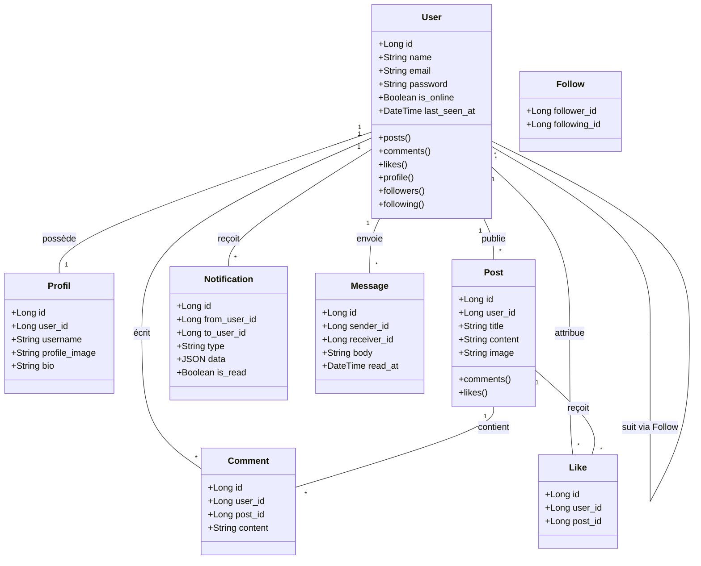
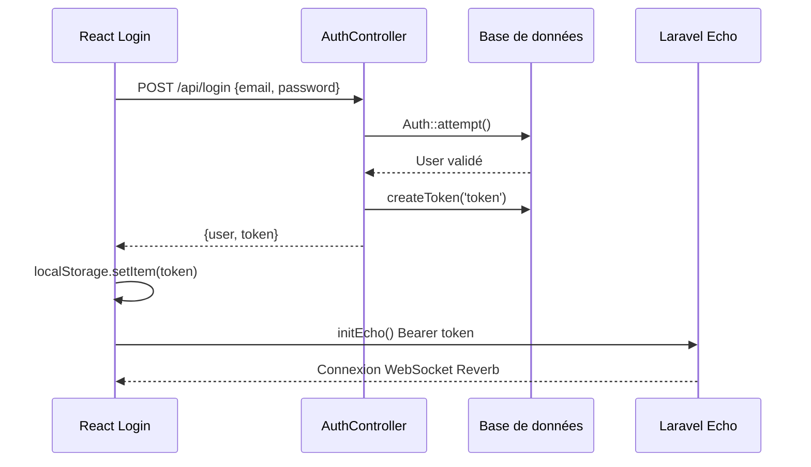
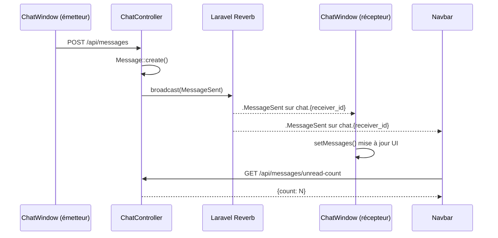
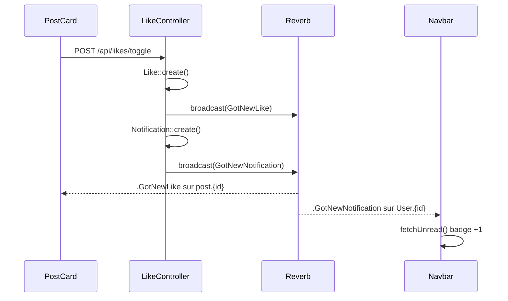
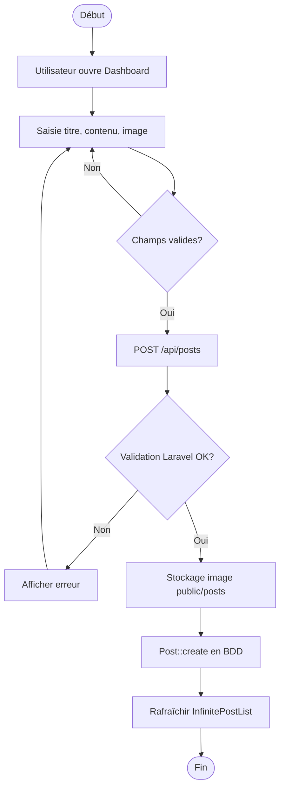
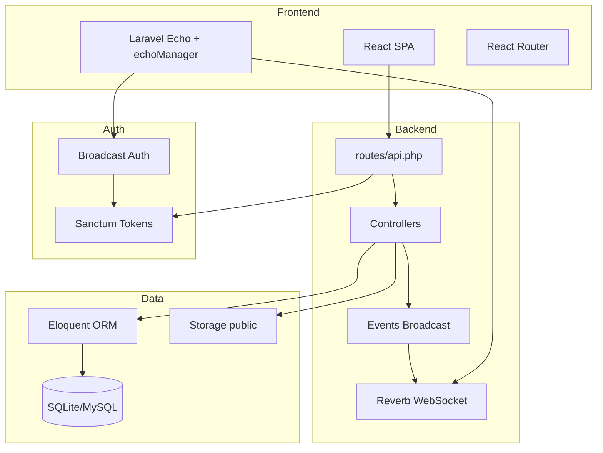
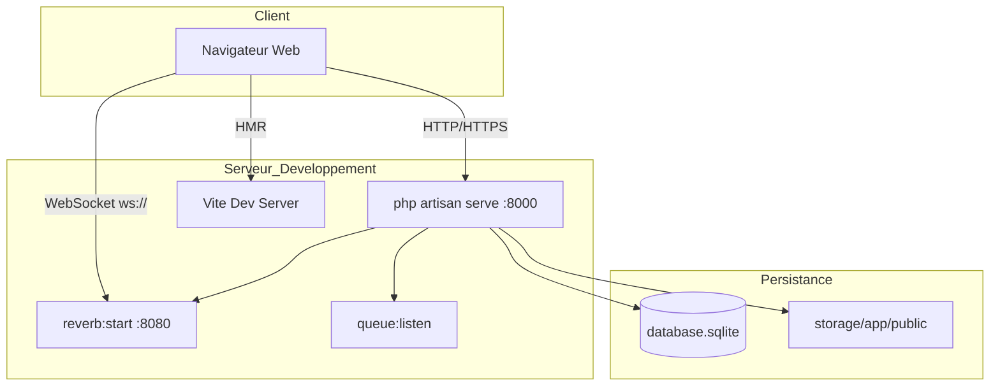

# Annexes UML — Diagrammes Mermaid (Harmony)

> Complément au fichier `Rapport_Synthese_Projet.docx` — à exporter en images pour insertion Word si nécessaire.

## Figure 1 — Diagramme de cas d'utilisation

## Figure 2 — Diagramme de classes

## Figure 3 — Séquence : Authentification

## Figure 4 — Séquence : Message temps réel

## Figure 5 — Séquence : Like + Notification

## Figure 6 — Diagramme d'activité : Publication post

## Figure 7 — Diagramme de composants

## Figure 8 — Diagramme de déploiement

